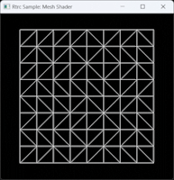
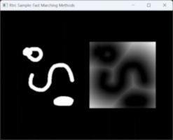
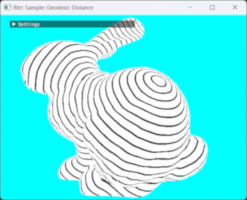
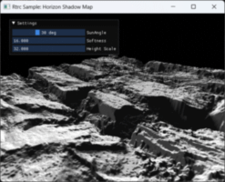
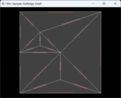
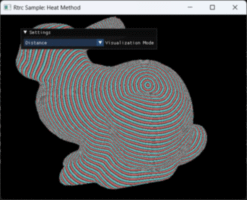

# Rtrc

Personal real-time graphics toolkits


Minimal example (clear the framebuffer to sky blue):

```c++
#include <Rtrc/Rtrc.h>

using namespace Rtrc;

class Demo : public SimpleApplication
{
    void UpdateSimpleApplication(GraphRef graph) override
    {
        auto framebuffer = graph->RegisterSwapchainTexture(GetSwapchain());
        RGClearColor(graph, "ClearFramebuffer", framebuffer, { 0.0, 1.0, 0.0, 0.0 });
    }
};

RTRC_APPLICATION_MAIN(
    Demo,
    .title  = "Rtrc Demo",
    .width  = 640,
    .height = 480)
```

## Samples

| Name | Thumbnail |
|:-:|:-:|
| 01.TexturedQuad<br>Basic texture mapping |  |
| 02.ComputeShader<br>Basic usage of compute shader |  |
| 03.BindlessTexture<br>Basic usage of bindless resource array |  |
| 04.RayTracingTriangle<br>Basic usage of ray tracing pipeline |  |
| 05.PathTracing<br>Basic unidirectional path tracer using ray query |  |
| 06.DistortionFreeDisplacementMap<br>https://cg.ivd.kit.edu/english/undistort.php |  |
| 07.Gizmo<br>Basic gizmo elements |  |
| 08.FeatureAwareDisplacementMap <br>https://airguanz.github.io/articles/2024.02.23.VDM-Baking |  |
| 09.MeshShader<br>Basic usage of mesh shader |  |
| 10.FastMarchingMethod<br>Basic fast marching method on 2d grid |  |
| 11.GeodesicDistance<br>Geodesic distance field on voxels |  |
| 12.ShaderDSL<br>Embedded DSL in C++ for writing shader |  |
| 13.HorizonMap<br>Basic horizon shadow described in paper<br>'Interactive Horizon Mapping' |  |
| 14.HalfedgeMesh<br>Halfedge data structure for triangle mesh |  |
| 15.HeatMethod<br>Heat method for geodesic distance computation |  |
| WIP | ... |

## Third-party Dependencies

[avir](https://github.com/avaneev/avir) for image resizing

[bvh](https://github.com/madmann91/bvh) for BVH construction

[Catch2](https://github.com/catchorg/Catch2) for testing

[cista](https://github.com/felixguendling/cista) for counting class members

[cxxopts](https://github.com/jarro2783/cxxopts) for parsing command arguments

[cyCodeBase](http://www.cemyuksel.com/cyCodeBase/) for generating possion disk samples

[D3D12MemAlloc](https://github.com/GPUOpen-LibrariesAndSDKs/D3D12MemoryAllocator) for memory management in D3D12 backend

[DearImGui](https://github.com/ocornut/imgui) for creating GUI in samples

[DirectXAgilitySDK](https://devblogs.microsoft.com/directx/directx12agility/) (binary) for accessing D3D12 preview features

[DirectXShaderCompiler](https://github.com/microsoft/DirectXShaderCompiler) (binary) for compiling shaders

[Eigen](https://eigen.tuxfamily.org/index.php?title=Main_Page) for solving linear systems

[fmt](https://github.com/fmtlib/fmt?tab=License-1-ov-file) for formatting strings

[geometry-central](https://github.com/nmwsharp/geometry-central) for computing local parameterization (logarithmic map)

[GLFW](https://www.glfw.org/) for managing windows and system events

[half](https://github.com/melowntech/half) for conversions between float16 and float32

[libigl](https://libigl.github.io/) for planar mesh parameterization in samples

[magic_enum](https://github.com/Neargye/magic_enum) for formatting enum values

[mimalloc](https://github.com/microsoft/mimalloc) for memory allocation

[nlohmann-json](https://github.com/nlohmann/json) for parsing & writing JSON strings

[oneapi-tbb](https://github.com/oneapi-src/oneTBB) for spin locks and thread-safe containers

[ryu](https://github.com/ulfjack/ryu/tree/master) for numer-to-string conversion

[sigslot](https://github.com/palacaze/sigslot) for thread-safe event broadcasting

[smhasher](https://github.com/rurban/smhasher) for hash operators

[spdlog](https://github.com/gabime/spdlog) for logging

[SPIRV-Reflect](https://github.com/KhronosGroup/SPIRV-Reflect) for reflecting SPIRV codes

[stb](https://github.com/nothings/stb) for image IO

[tinyexr](https://github.com/syoyo/tinyexr) for EXR image IO

[tinyobjloader](https://github.com/tinyobjloader/tinyobjloader) for loading wavefront obj files

[unordered_dense](https://github.com/martinus/unordered_dense) for replacing `std::unordered_*`

[vk-bootstrap](https://github.com/charles-lunarg/vk-bootstrap) for Vulkan initialization

[volk](https://github.com/zeux/volk) for loading Vulkan entry points

[VulkanMemoryAllocator](https://github.com/GPUOpen-LibrariesAndSDKs/VulkanMemoryAllocator) for memory management in Vulkan backend

[WinPIXEventRuntime](https://devblogs.microsoft.com/pix/winpixeventruntime/) (binary) for generating PIX captures
