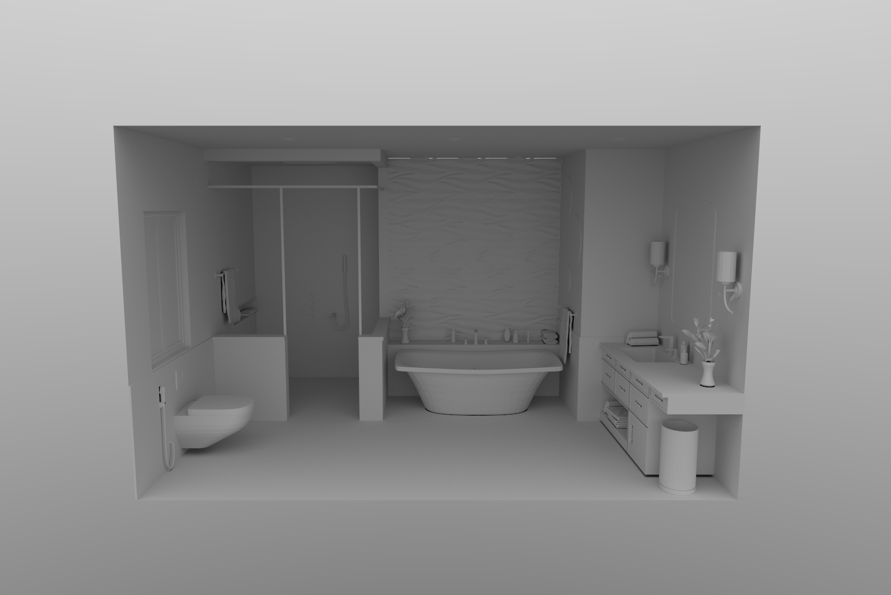

# Rtrc

Real-time rendering playground

- [x] Render graph
- [x] Shader system with explicit binding group management
- [x] Physically-based sky renderer
- [x] Vulkan/DirectX12 RHI

Note that `Sample 4~5` and `StandaloneRenderer` is only runnable with Vulkan backend since ray tracing in DirectX12 backend hasn't been finished.

## TODO

- [ ] DirectX12 Ray tracing (WIP)
- [ ] Remove reference counting in RHI layer

